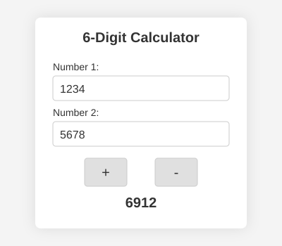

# 6-Digit Calculator

[](LICENSE)

A simple web-based calculator that performs basic arithmetic operations. Built with HTML, CSS, and vanilla JavaScript, this lightweight application runs entirely in the browser with no backend dependencies.



*The calculator interface with Number 1 and Number 2 input fields, addition and subtraction buttons, and the calculated result.*

## Overview

The 6-Digit Calculator is a client-side web application designed for performing basic arithmetic calculations. It currently supports addition and subtraction operations, with plans to expand to full basic arithmetic including multiplication and division.

### Features

- **Supported Operations**: Addition (+) and subtraction (-), with multiplication and division planned for future releases
- **6-Digit Limit**: Handles integer inputs up to 6 digits (values from -999999 to 999999)
- **Overflow Detection**: Displays an "Overflow" message when results exceed the 6-digit limit
- **Input Validation**: Real-time validation ensures only valid numeric inputs are accepted
- **Responsive Design**: Clean, mobile-friendly interface that works on desktop and mobile browsers
- **Accessible**: Built with semantic HTML and ARIA attributes for screen reader compatibility

### Technology Stack

- **HTML5**: Semantic markup with accessibility features
- **CSS3**: Responsive styling with flexbox layout
- **Vanilla JavaScript**: No external libraries or frameworks required

### Deployment

This is a purely client-side application with no server-side dependencies. It can be:

- Opened directly in a web browser from the local filesystem
- Hosted on any static web server
- Deployed to GitHub Pages
- Served via simple HTTP servers (Python, Node.js, etc.)

No build process, compilation, or package installation is required.

## Prerequisites

### Supported Browsers

This application works in any modern web browser. The following minimum versions are officially supported:

- **Google Chrome**: Version 90 or higher
- **Mozilla Firefox**: Version 88 or higher
- **Microsoft Edge**: Version 90 or higher

### Optional Tools

These tools are not required but are helpful for certain installation and running methods:

- **Git**: Required if you want to clone the repository (download the ZIP file as an alternative)
- **Python 3** or **Node.js**: Required only if you want to run a local HTTP server

## Installation

Follow these steps to get a copy of the project on your local machine.

### Option 1: Clone with Git

1. Open your terminal (Command Prompt on Windows, Terminal on macOS/Linux)
2. Navigate to the folder where you want to store the project
3. Run the following command:
   ```
   git clone https://github.com/sahanpinavida/6-digit-calculator.git
   ```
4. Navigate into the project folder:
   ```
   cd 6-digit-calculator
   ```

### Option 2: Download ZIP

1. Visit the repository page on GitHub
2. Click the green "Code" button
3. Select "Download ZIP"
4. Extract the ZIP file to your desired location

## Running the App

There are two ways to run the calculator. Choose the method that works best for you.

### Method 1: Open Directly in Browser (Simplest)

This is the quickest way to start using the calculator:

1. Open your file explorer and navigate to the project folder
2. Find the file named `index.html`
3. Double-click `index.html` to open it in your default browser
4. Alternatively, right-click the file and select "Open with" to choose a specific browser

The calculator should now be running in your browser.

### Method 2: Use a Local HTTP Server

Some browser features work better when served from an HTTP server. Use this method if you encounter any issues with Method 1.

**Using Python (version 3):**

1. Open your terminal and navigate to the project folder
2. Run the following command:
   ```
   python -m http.server 8000
   ```
3. Open your browser and go to: `http://localhost:8000`

**Using Node.js:**

1. Open your terminal and navigate to the project folder
2. Run one of the following commands:
   ```
   npx serve
   ```
   or
   ```
   npx http-server
   ```
3. Open the URL shown in the terminal (usually `http://localhost:3000` or `http://localhost:8080`)

To stop the server, press `Ctrl+C` in the terminal.

## Usage

### User Interface

The calculator has a simple, intuitive interface with the following components:

- **Number 1 Input**: Enter the first number for your calculation
- **Number 2 Input**: Enter the second number for your calculation
- **Operation Buttons**: Click the button for the operation you want to perform
- **Result Display**: Shows the result of your calculation or an error message

### Input Constraints

- Numbers must be integers (whole numbers)
- Maximum 6 digits per input (values from -999999 to 999999)
- Negative numbers are supported (use a leading minus sign, e.g., -123)
- Results exceeding 6 digits will display "Overflow"

### Examples

The following examples demonstrate how to use the calculator with different operations.

#### Addition (Available Now)

| Number 1 | Number 2 | Operation | Result |
|----------|----------|-----------|--------|
| 1234 | 5678 | + | 6912 |
| 100 | -50 | + | 50 |
| 999999 | 0 | + | 999999 |
| 500000 | 500000 | + | Overflow |

#### Subtraction (Available Now)

| Number 1 | Number 2 | Operation | Result |
|----------|----------|-----------|--------|
| 5000 | 1234 | - | 3766 |
| 100 | 250 | - | -150 |
| -100 | -50 | - | -50 |
| -999999 | 1 | - | Overflow |

#### Multiplication (Coming Soon)

| Number 1 | Number 2 | Operation | Result |
|----------|----------|-----------|--------|
| 123 | 45 | * | 5535 |
| 1000 | 1000 | * | Overflow |

#### Division (Coming Soon)

| Number 1 | Number 2 | Operation | Result |
|----------|----------|-----------|--------|
| 100 | 4 | / | 25 |
| 99 | 10 | / | 9 |

### Error Handling

The calculator validates your input as you type:

- **Invalid input**: Displayed when non-numeric characters are entered
- **Overflow**: Displayed when the result exceeds the 6-digit limit (greater than 999999 or less than -999999)
- **Disabled buttons**: Operation buttons are disabled until both inputs contain valid numbers

## Contributing

We welcome contributions to the 6-Digit Calculator! This section explains how to contribute effectively.

### How to Contribute

1. **Fork the repository**: Click the "Fork" button on the GitHub repository page
2. **Clone your fork**:
   ```
   git clone https://github.com/YOUR-USERNAME/6-digit-calculator.git
   ```
3. **Create a branch**: Create a new branch for your changes (see branch naming below)
4. **Make your changes**: Implement your feature or fix
5. **Commit your changes**: Follow the commit message conventions below
6. **Push to your fork**: Push your branch to your forked repository
7. **Open a Pull Request**: Submit a PR from your branch to the main repository

### Coding Standards

Please follow these coding standards to maintain consistency with the existing codebase:

**JavaScript (script.js)**
- Use `"use strict";` at the top of JavaScript files
- Write clean, readable, and modular code
- Each function should handle a single responsibility
- Use descriptive variable and function names
- Add inline comments to explain key logic
- No external libraries or frameworks

**HTML (index.html)**
- Follow semantic HTML structure
- Use appropriate ARIA attributes for accessibility
- Use descriptive labels and IDs

**CSS (styles.css)**
- Organize styles with class-based selectors
- Use consistent indentation (2 spaces)
- Group related styles together
- Keep the design responsive

### Commit Message Conventions

Write clear and meaningful commit messages:

- **Subject line**: Use imperative mood, keep under 50 characters
  - Good: "Add multiplication operation"
  - Bad: "Added multiplication" or "Adding multiplication operation to calculator"
- **Body** (optional): Explain what and why, wrap at 72 characters
- **Reference issues**: Include issue numbers when applicable (e.g., "Fix #42")

**Examples:**
```
Add input validation for negative numbers

Implement validation logic to handle negative number inputs
correctly. This ensures the minus sign is only accepted at
the start of the number.

Fixes #15
```

```
Fix overflow detection for subtraction
```

### Branch Naming Strategy

Use descriptive branch names with the following prefixes:

- `feature/` - New features (e.g., `feature/42-add-multiplication`)
- `fix/` - Bug fixes (e.g., `fix/15-negative-number-validation`)
- `docs/` - Documentation changes (e.g., `docs/update-readme`)
- `refactor/` - Code refactoring (e.g., `refactor/simplify-validation`)

Include the issue number when applicable: `feature/123-feature-description`

### Issue and Pull Request Templates

To help maintain quality contributions, please use our templates:

- [Issue Template](.github/ISSUE_TEMPLATE.md) - For reporting bugs or requesting features
- [Pull Request Template](.github/PULL_REQUEST_TEMPLATE.md) - For submitting changes

### Future Enhancements

The following community standards are planned for future implementation:

- **CODE_OF_CONDUCT.md** - Community behavior guidelines
- **SECURITY.md** - Security policy and vulnerability reporting

### Questions?

If you have questions about contributing, please open an issue with the "Question" label.

## Changelog

For a detailed list of changes, new features, and bug fixes, see the [CHANGELOG.md](CHANGELOG.md) file.

### Roadmap

Planned features for future releases:

- Multiplication operation (*)
- Division operation (/)
- Keyboard shortcuts for operations
- History of recent calculations

## License

This project is licensed under the MIT License. See the [LICENSE](LICENSE) file for details.
